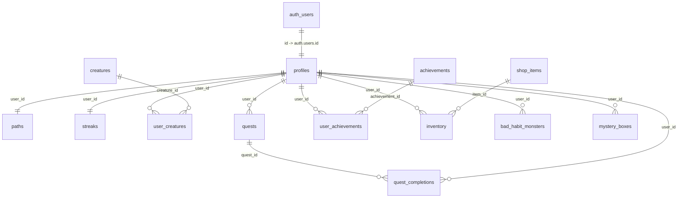

# LIFEQUEST (NEXUS) — DATABASE SCHEMA SPECIFICATION

**Database Engine:** PostgreSQL 15+ (Hosted on Supabase)  
**Security Model:** Row-Level Security (RLS) enabled on all user tables  

---

## 1. Relational Entity Diagram

---

## 2. Table Definitions

### 2.1 `profiles`
The master player state record linked directly to Supabase Auth (`auth.users`).
| Column | Type | Constraints | Description |
| :--- | :--- | :--- | :--- |
| `id` | `UUID` | `PRIMARY KEY, REFERENCES auth.users ON DELETE CASCADE` | Matches auth user ID |
| `display_name` | `TEXT` | `NOT NULL DEFAULT 'Adventurer'` | Public handle |
| `timezone` | `TEXT` | `DEFAULT 'UTC'` | Local timezone for streak calculations |
| `nexus_level` | `INT` | `NOT NULL DEFAULT 1` | Derived level from lifetime XP |
| `lifetime_xp` | `INT` | `NOT NULL DEFAULT 0` | Cumulative validated XP |
| `nexus_coins` | `INT` | `NOT NULL DEFAULT 0` | In-game currency ("Gold") |
| `consistency_tier`| `TEXT` | `NOT NULL DEFAULT 'Casual'` | Casual, Consistent, or Hardcore |
| `active_creature_id`| `INT`| `NOT NULL DEFAULT 1` | Currently bonded companion |
| `created_at` | `TIMESTAMPTZ`| `DEFAULT NOW()` | Account inception timestamp |

### 2.2 `paths`
Stores attribute points for the 5 RPG growth pillars.
| Column | Type | Constraints | Description |
| :--- | :--- | :--- | :--- |
| `user_id` | `UUID` | `PRIMARY KEY, REFERENCES profiles(id) ON DELETE CASCADE` | Owner |
| `learning` | `INT` | `NOT NULL DEFAULT 0` | Knowledge & technical mastery |
| `fitness` | `INT` | `NOT NULL DEFAULT 0` | Physical conditioning & health |
| `creativity`| `INT` | `NOT NULL DEFAULT 0` | Innovation, writing, design |
| `discipline`| `INT` | `NOT NULL DEFAULT 0` | Willpower & consistency |
| `social` | `INT` | `NOT NULL DEFAULT 0` | Networking & relationships |

### 2.3 `streaks`
Tracks unbroken daily quest qualification.
| Column | Type | Constraints | Description |
| :--- | :--- | :--- | :--- |
| `user_id` | `UUID` | `PRIMARY KEY, REFERENCES profiles(id) ON DELETE CASCADE` | Owner |
| `current_streak` | `INT` | `NOT NULL DEFAULT 0` | Current consecutive active days |
| `longest_streak` | `INT` | `NOT NULL DEFAULT 0` | All-time highest consecutive days |
| `last_qualifying_date`| `DATE` | `NULLABLE` | Date of last eligible completion |
| `monthly_freezes_used`| `INT` | `NOT NULL DEFAULT 0` | Max 2 streak freezes per calendar month |
| `last_freeze_date` | `DATE` | `NULLABLE` | Date last freeze was consumed |

### 2.4 `creatures` & `user_creatures`
Elemental companion catalog and player ownership roster.
- `creatures`: `id`, `name`, `theme`, `passive_name`, `passive_description`.
- `user_creatures`: `id`, `user_id`, `creature_id`, `nickname`, `current_level`, `created_at`.
- *Starter Seeds:* Spriggo (Earth/Learning), Ignis (Fire/Fitness), Aqualis (Water/Mind).

### 2.5 `quests` & `quest_completions`
Core quest storage and immutable completion logs.
- `quests`:
  - `id` (`UUID`, PK)
  - `user_id` (`UUID`, FK)
  - `title` (`TEXT`)
  - `description` (`TEXT`)
  - `path` (`TEXT`: Learning, Fitness, Creativity, Discipline, Social)
  - `difficulty` (`TEXT`: Easy, Medium, Hard, Epic)
  - `deadline` (`TIMESTAMPTZ`)
  - `planned_time` (`INT`, minutes)
  - `status` (`TEXT`: active, completed, expired, failed)
  - `reschedule_count` (`INT`)
- `quest_completions`:
  - `id` (`UUID`, PK)
  - `quest_id` (`UUID`, FK nullable)
  - `user_id` (`UUID`, FK)
  - `xp_earned`, `coins_earned`, `path_progressed`, `completed_at`

### 2.6 `achievements` & `user_achievements`
Condition-based awards honoring milestones in quests, streaks, levels, and bosses.

### 2.7 `shop_items` & `inventory`
Cosmetic store catalog and user wardrobe.
- Rarity tiers: Common, Rare, Epic, Legendary.
- Types: title, badge, companion_skin, theme.
- `inventory`: `id`, `user_id`, `item_id`, `is_equipped`, `acquired_at`.

### 2.8 `bad_habit_monsters` & `mystery_boxes`
Anti-habit raid boss tracking and reward chests.
- `bad_habit_monsters`: `id`, `user_id`, `name`, `bad_habit`, `description`, `max_hp`, `current_hp`, `threat_level`, `status`, `defeated_at`.
- `mystery_boxes`: `id`, `user_id`, `source_monster_id`, `is_opened`, `reward_type`, `reward_amount`, `opened_at`.

---

## 3. Row-Level Security (RLS) Matrix
| Table | SELECT | INSERT | UPDATE | DELETE |
| :--- | :--- | :--- | :--- | :--- |
| `profiles` | Public (anon/auth) | Trigger only | `auth.uid() = id` | `auth.uid() = id` |
| `paths` | Public / Self | Trigger only | `auth.uid() = user_id` | `auth.uid() = user_id` |
| `streaks` | Public / Self | Trigger only | `auth.uid() = user_id` | `auth.uid() = user_id` |
| `creatures` | Public | None | None | None |
| `quests` | `auth.uid() = user_id` | `auth.uid() = user_id` | `auth.uid() = user_id` | `auth.uid() = user_id` |
| `quest_completions` | `auth.uid() = user_id` | `auth.uid() = user_id` | None (immutable) | None |
| `shop_items` | Public | None | None | None |
| `inventory` | `auth.uid() = user_id` | `auth.uid() = user_id` | `auth.uid() = user_id` | `auth.uid() = user_id` |
| `bad_habit_monsters`| `auth.uid() = user_id` | `auth.uid() = user_id` | `auth.uid() = user_id` | `auth.uid() = user_id` |
| `mystery_boxes` | `auth.uid() = user_id` | `auth.uid() = user_id` | `auth.uid() = user_id` | `auth.uid() = user_id` |

---

## 4. Auth Auto-Provisioning Trigger
When a new user is created in `auth.users`, a PostgreSQL trigger executes `handle_new_user()` to automatically:
1. Insert a row into `profiles` with default level 1, 0 XP, and 50 bonus starter Gold.
2. Insert a row into `paths` with 0 in all 5 attributes.
3. Insert a row into `streaks` with 0 streak and 0 freezes used.
4. Insert a row into `user_creatures` with creature ID 1 (Spriggo).
